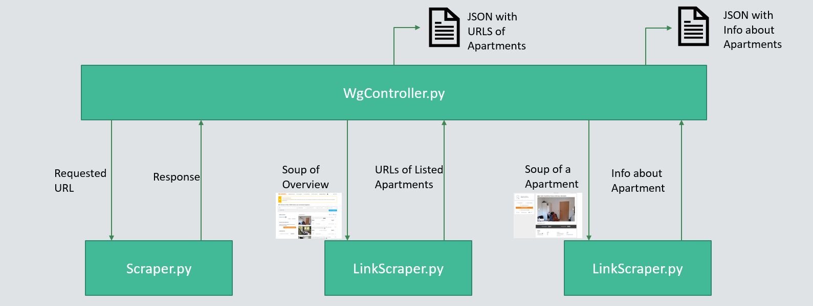
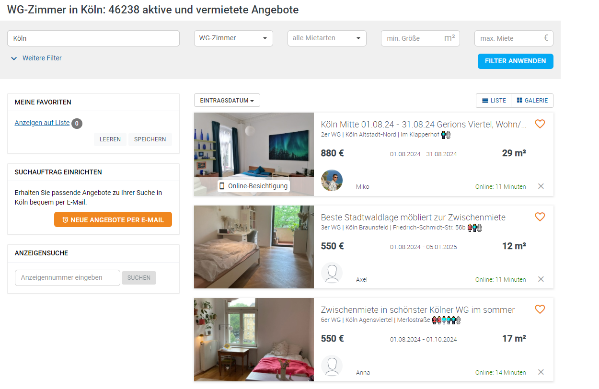
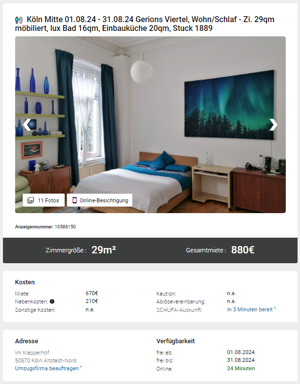
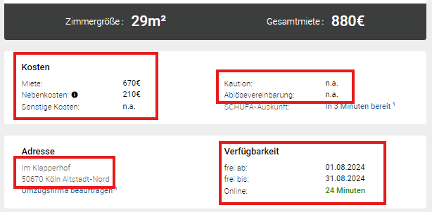
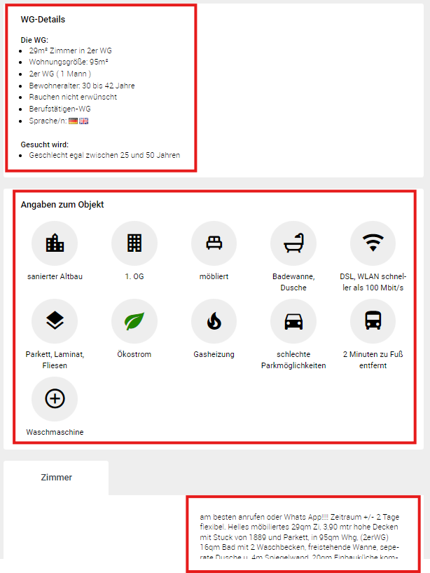

# Web Scraping for Rental Ads Analysis

## Scraping Structure

The scraping of the information was fully automated. To make the code as clear as possible, it was divided into 4 classes.

### Central Controller Class

The central class in the controller class. This controls the other classes and saves the intermediate and final results.

### Scraper.py Class

The scraper.py class is used to request the HTML response. Two different methods are currently implemented. On the one hand, the response can be requested directly. However, this can lead to problems if WG-scraper recognizes that too many requests are being sent too quickly from one IP address. In this case, the API of [Scraper-API](https://www.scraperapi.com/) is used. This allows requests to be sent via a proxy server so that WG-searched does not recognize that a large number of requests are being sent by a user. However, this is significantly slower than the direct request, which is why the first path is prioritized and Scraper Api is only used after 5 incorrect attempts.

### LinkScraper.py Class

The class LinkScraper.py extracts the links of the various ads of an [overview page of the WG-GESUCHT website](https://www.wg-gesucht.de/wg-zimmer-in-Koeln.73.0.1.0.html).

To do this, the class requires the "soup", which corresponds to a parsed HTML file. From this, the class can read both the sponsored links and the non-sponsored links. Sponsored links are displayed further up or down as advertising. These are not relevant for our investigations.

### AppartScraper.py Class

The AppartScraper.py class reads the data from an shared appartment ad.

The class also works with the parsed HTML file. The HTML gets processed and the relevant data is collected via the various functions. If the structure of the page changes, individual functions can be adapted to reuse large part of the code.

Among other things, price information, information on the duration, provided details and the descriptions are collected.

### Using the scraper classes

As described above, the central class is the Controller.py. When the class is started, a start page is specified and the number of overview pages to be searched is defined. The page is then requested via scraper.py and passed back to the controller. This passes the page to LinkScraper.py, which retrieves the unsponsored links. These are then returned to Controller.py. Now the original link is adjusted so that the second link page is loaded. This process is repeated as often as specified in the start function. WG-GESUCHT has a large number of overview pages. However, many of these contain only sponsored links or deactivated ads. Experience has shown that the relevant ads for Cologne are limited to the first 45 to 55 pages.

Once the links have been collected, they are saved in a JSON file. Controller.py then goes through the collected links and generates a response via scraper.py, which is processed by AppartScraper.py. The data is collected and saved in a JSON. The result is saved in the Data folder in the Scraping subfolder.

If errors occur, the incorrectly retrieved links are saved in a separate JSON so that the errors can be corrected if necessary.

### Data Collection Results

55 overview pages were retrieved for the case study. These contained 1100 links. (add) X of these could not be retrieved in full. This resulted in a data set with X (add) entries. (See JSON file)

## Scraping Over a Longer Period

### Introduction
In order to obtain more powerful data, you should not only retrieve the data once, but do this over a longer period of time. For example, you could run a modified script on a server every hour or every day. Theoretically, you could also run the same script every day, but in this case a lot of redundant data would be stored.

### Strategy for Reducing Redundancy
To prevent this, I would modify the script so that after querying all relevant links with the help of the LinkScraper.py class, a comparison is made between the previous links and the new ones. If links are in the old file but no longer in the new one, this means that these ads have been deactivated or deleted. In this case, a note about the deactivation date can be saved.

If there are new links in the file, these should be included in the final data set. Before doing so, you should check whether there is a data record with the same values already included under another link. It is possible that the landlord has recreated the advertisement in order to be displayed higher up in the list. In this case, the old data record should be retained and the new link saved in a corresponding column for future comparisons.

Shared appartments that are in both the old and the new link overview do not need to be called up again.

### Data Maintenance
For easier data maintenance, the storage format should also be reconsidered. For example, a database could replace the JSON files for storage and ensure efficient comparison and storage of data.

## Data Collection Ethics
Web scraping always raises ethical questions, as it involves the unsolicited collection of data from users who are not informed about it and therefore have no opportunity to have their data deleted. As a technically savvy person, one could argue that the user must expect this, but this does not apply to the majority of the population. A disclaimer by the site operator warning users about a possible outflow of data to third parties might be helpful here. But there is no such disclaimer. Therefore, there are a few principles we should keep in mind when scraping.

### Privacy and Anonymity
In order to minimize the inconvenience for the user, you should check the consequences, especially when publishing a data set. In order to protect the privacy of users, it is essential to anonymize the data. For example, you should not publish the name and address of a user together, but instead replace the name with a randomly generated code and the address with the zip code. This makes it impossible to draw conclusions about the actual person.

### Responsibility Towards Website Operators
In addition to the responsibility towards the users of a website, the responsibility towards the operator of the site must also be taken into account. For example, automated requests should be kept to a necessary minimum so as not to disrupt the normal operation of the server in the form of a DDOS.

### Conclusion
However, if the points just described are taken into account, the damage to the users of the site and the operator is negligible. In addition, the data is not used to send advertising or generate profit from it, but is used exclusively for scientific purposes in this project.

Overall, it can be said that web scraping will never be ethically perfect, but if some principles are followed, no harm will come from collecting the data.

